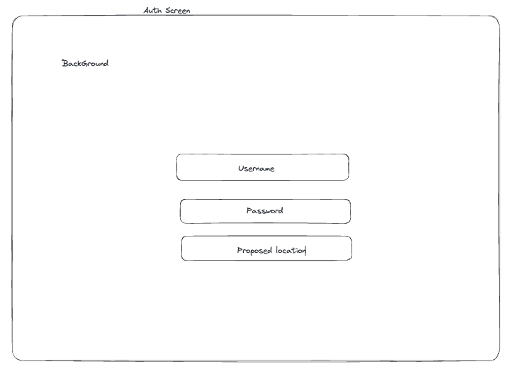
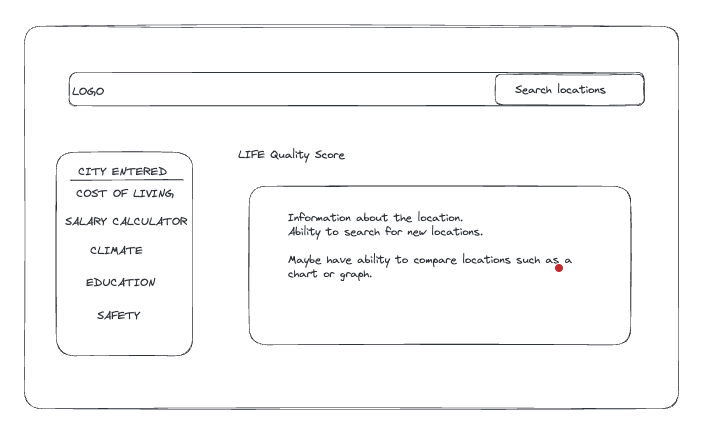
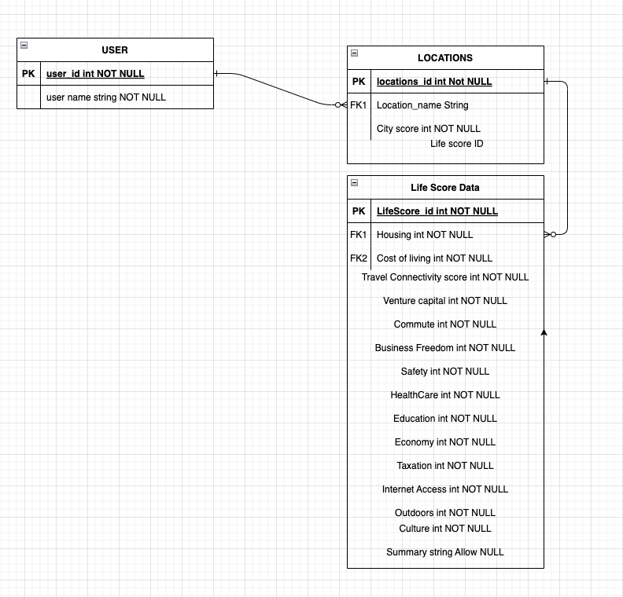
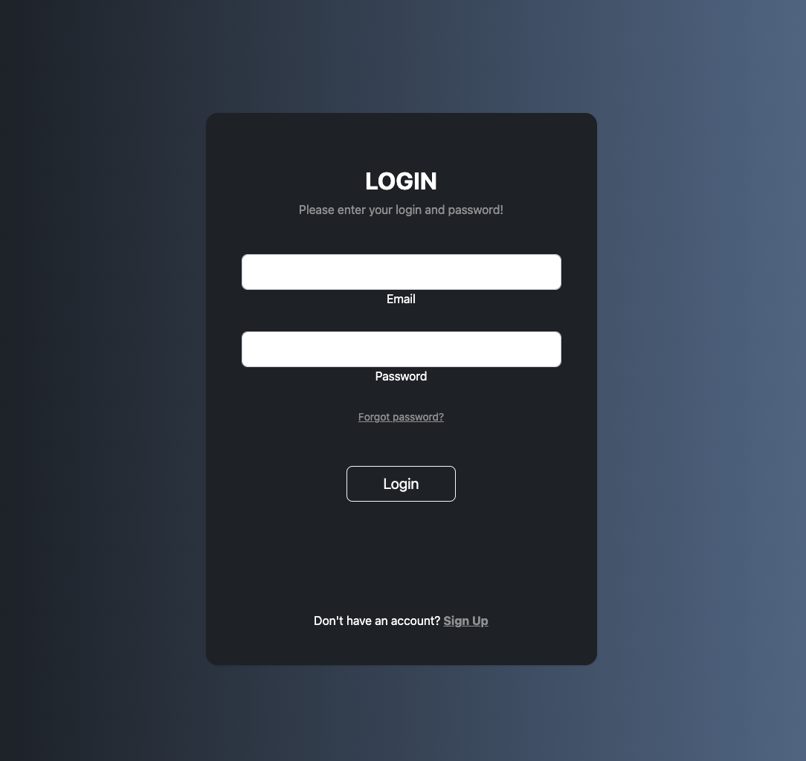
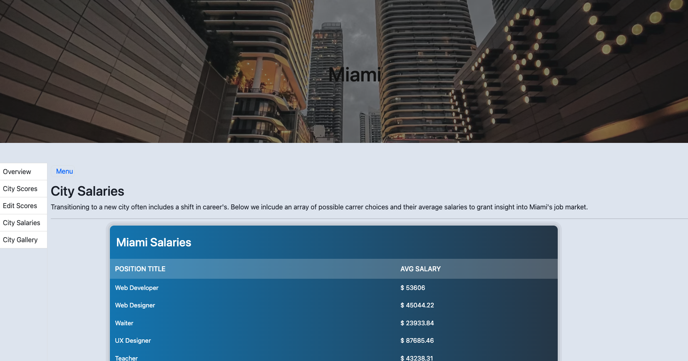

# Transition

## Description 
Transition is a web app that provides life quality data for different regions. When planning a big moves there was always a lot of data to be sourced from a myriad of different spaces. Transition aims to provide the public with a single platform to see all the information related to a proposed location prior to moving. This allows viewers to make a mindful decision on the next steps of their future.
This web app is built using the <strong>Teleport-API</strong> and the data provided.

### Features 
* Life score data for different cities amongst differing qualities
* Overall city score that can be compared with others
* Gallery feature where we allow users add their own images
* Login in feature that affords users access to restricted pages

## Process

### Wireframes 

### Deployment

## How to Install
* `Fork` and `Clone` this repository to your computer.
* Install the needed dependencies with npm I -
* Add a .env file globally and include your `SECRET_SESSION` and it's value.
* To start the webpage, `npm run dev` in your terminal, then open in your browser with the address `http://localhost:3000/`
* Explore the App in your browser. 

# Future Enhancments
* Would like to implement a search feature that directly pings the API
* Favorites feature for users
* Provide linkage that allows uses to browse living spaces in the cities they are looking at.
* Incorporate a direct comparison board where users can compare their favorites. 

## Contributing
Pull requests are welcome. For major changes, please open an issue first
to discuss what you would like to change.

Please make sure to update tests as appropriate.

# License 
[MIT](https://choosealicense.com/licenses/mit/)
